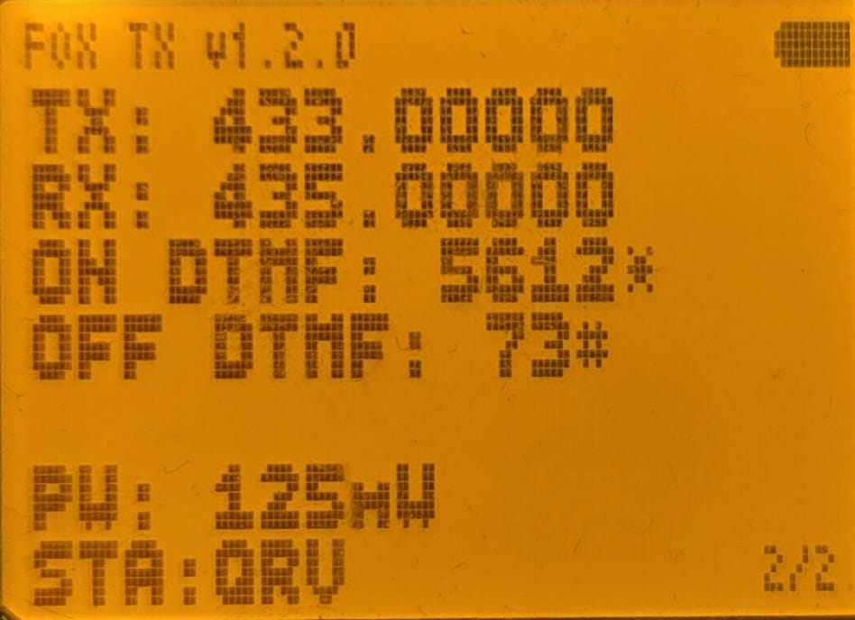

# F4HWN Firmware with CW Beacon Feature.
This is an implementation/demo of the CW beacon. A custom string and speed in WPM can be set and it will chnage each charactors into the morse code tones while transmitting it.
PS: Bandscope was replcaed to this due to the capacity issue. 

# Use Case - Concept
I made this mainly for the FOX HUNT beacon purposes. The modulation is FM, so most of all receivers, handhelds can receive it without any problem. 

# Photos & Videos

  
[Demo video by me - 4S7JL Youtube](https://youtu.be/czbjfnymDrc?si=UJAQRbGu7nhtoQbZ)

# How it Works?
- App is opened using F+5 Key combination.
- Power levels can be adjusted using the up down arrow keys.
- Using Key 1 and 4, you can turn to the other page.  -  1st Page has the general stuff, - and 2nd page has the Frequencies and DTMF information.
- Press Menu Key to activate TX.
- Press Exit to deactivate the TX.
- It can also be Activated/Deactivated by the custom DTMF codes. (More in the next section!)

## About the DTMF funtions
The new feature in v1.2.0 utilizes of 2 VFOs.  The Morse App will use the Main VFO as a TX Frequency and the other as a RX frequency for DTMF reception.  
So:
if it's in main VFO A (ex. 433MHz), and sub VFO B (ex. 435MHz), You will have to TX DTMF to the VFO B (435MHz) to trigger.
  If they are the same, you can TX to the same frequency.

# Customization
Customization of the CW Settings can be done in the Radio menu (No. 3-10) or Via Chirp. 
You can customize variety of parameters:
- WPM
- Tone Frequency in Hz
- Initial Beep time 
- Waiting time
- DTMF Configs (On/Off Codes)

# Steps to Flash & Configure

## Flashing
1. Download the latest firmware file from the release page.
2. Upload it using Programming Cable.
3. Done!

## Configuration
0. Connect the Radio with the Programming Cable while it is ON.
1. Load driver module in Chirp. -> If you don't see the module import menu, make sure that the Developer Mode is enabled under Help.
2. Click Radio > Select your Serial Device > Download from the radio > OK
3. Settings > CW Settings
4. Edit Parameters you want.
5. Once done, Click Radio > Upload > OK

# Have you got an Idea or Suggestions?
Feel free to post it in the discussion tab here or you can emails to me.
Direct contributions via github is also possible. 
